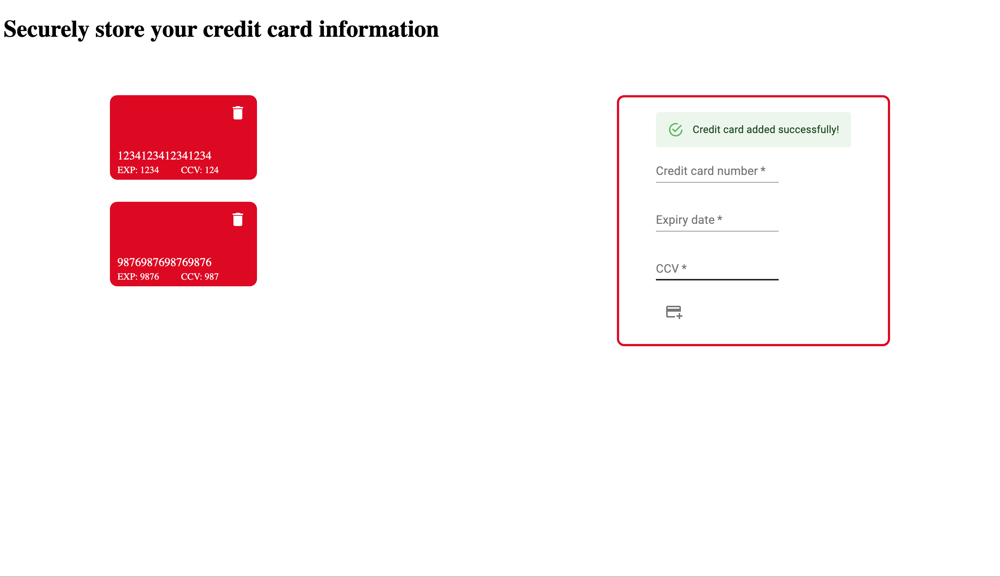

# Credit Card Storage React Redux Application

This React app allows you to securely store and manage your credit card information with ease. Powered by React and Redux which ensures a seamless and intuitive user experience.

## Features
* Securely store and manage your credit card details in one central location.
* Easily add, edit, and delete credit card information.
* Simple and intuitive user design using MUI.
* Seamless integration with React and Redux for efficient state management.

## Getting Started
To run this Credit Card Storage Web Application locally, follow these steps:

1. Clone the repository:
git clone https://github.com/your-username/credit-card-storage.git

2. Install dependencies:
cd credit-card-storage
npm install

3. Start the development server:
npm start

4. Open the application in your browser:
http://localhost:3000/

## Technologies Used
This web application utilizes the following technologies:
* React
* Redux
* HTML/CSS

## Thanks for viewing my app!
